#  Sprint 1 - İletişim, Toplantı ve Araştırma Kanıtları (Artifacts)

Bu dizin, **DrugSense** (Grup 37) takımının Sprint 1 boyunca yürüttüğü asenkron iletişim, fikir geliştirme, araştırma ve toplantı süreçlerinin kanıtlarını içermektedir. Çevik (Agile) prensiplere uygun olarak takım içi senkronizasyon mesajlaşma platformları üzerinden sağlanmıştır.

---

###  1. Proje Fikri ve İsimlendirme Aşaması
Projemizin çıkış noktası olan polifarmasi sorununun tespiti ve takımın proje ismi üzerindeki beyin fırtınaları:
* **Çıkış Noktası:**
  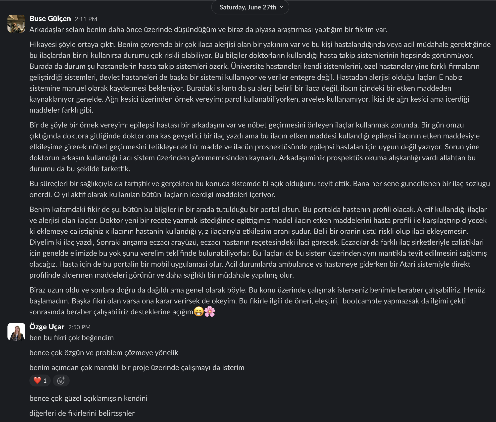
* **İsimlendirme Kararı:**
  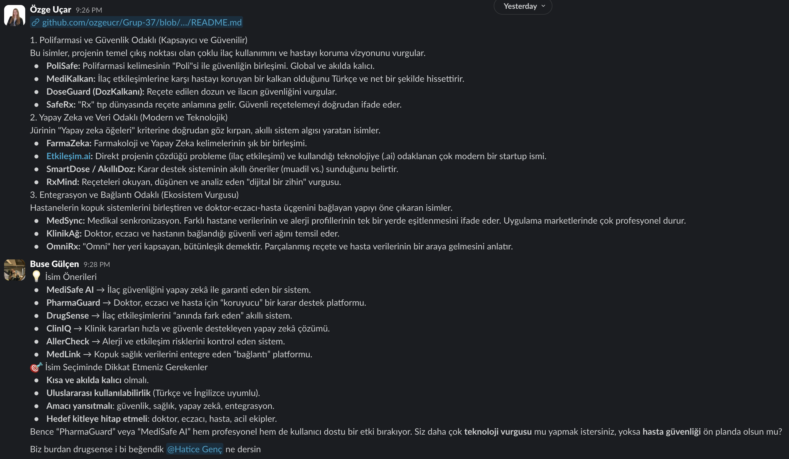

---

###  2. Sprint Planlaması ve Takım Toplantıları
Sprint hedeflerinin belirlenmesi, toplantıların organize edilmesi ve yapılan toplantıların sonrasındaki durum analizleri:
* **Planlama ve Organizasyon:**
  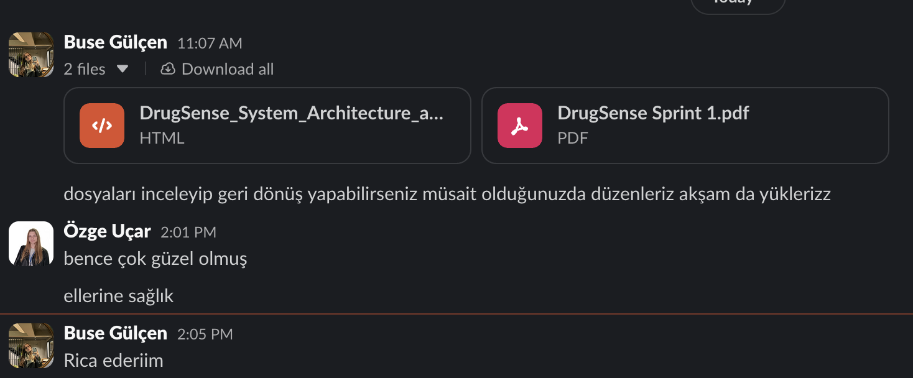
  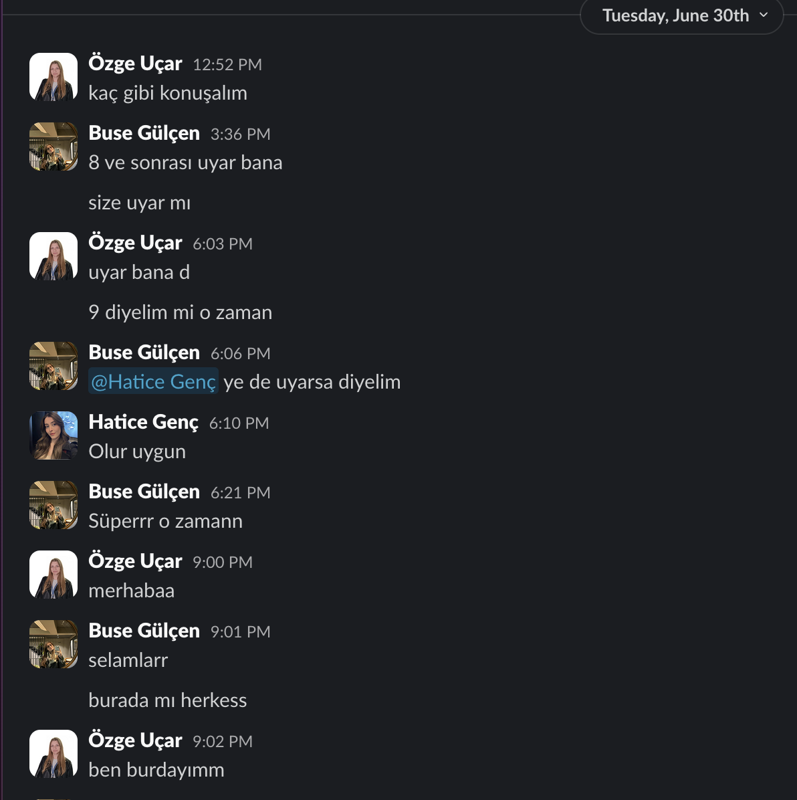
  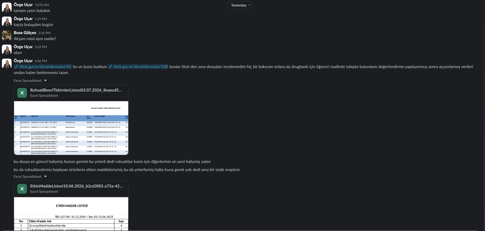
* **Toplantı Esnası Check-in'ler:**
  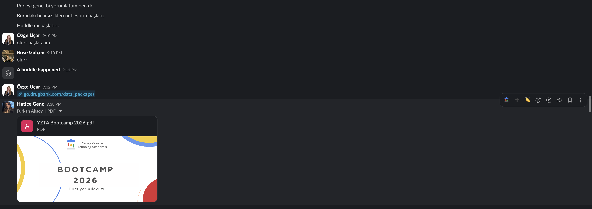
  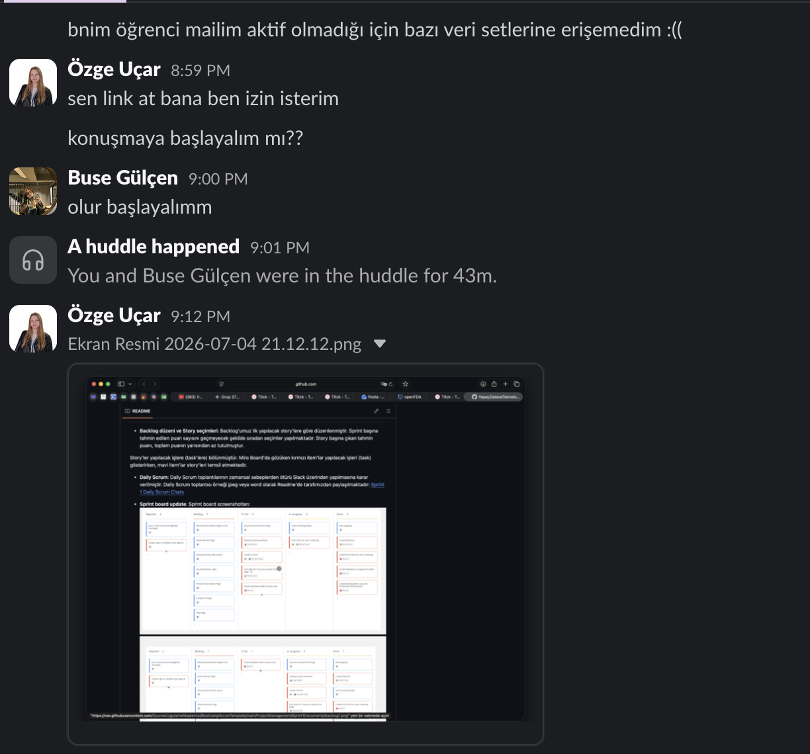
* **Toplantı Sonrası Karar Analizleri:**
  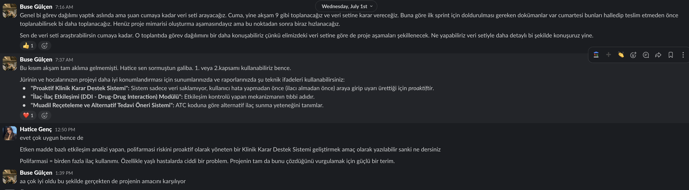
  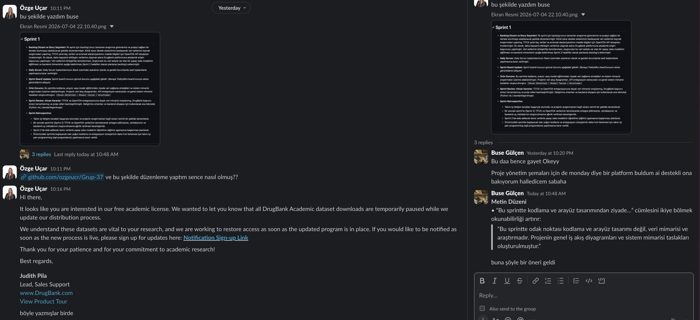

---

###  3. Teknik Altyapı ve Sistem Mimarisi
GitHub ortamının ayağa kaldırılması ve geliştirilecek platformun mimari yapı tartışmaları:
* **GitHub Kurulumu:**
  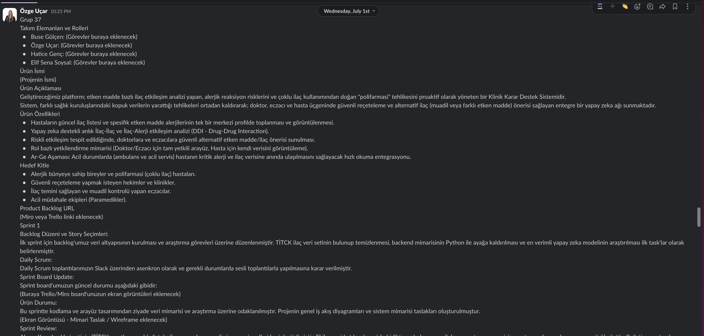
  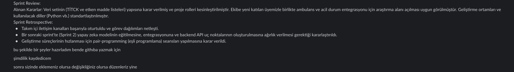
* **Proje Yapısı ve Mimarisi:**
  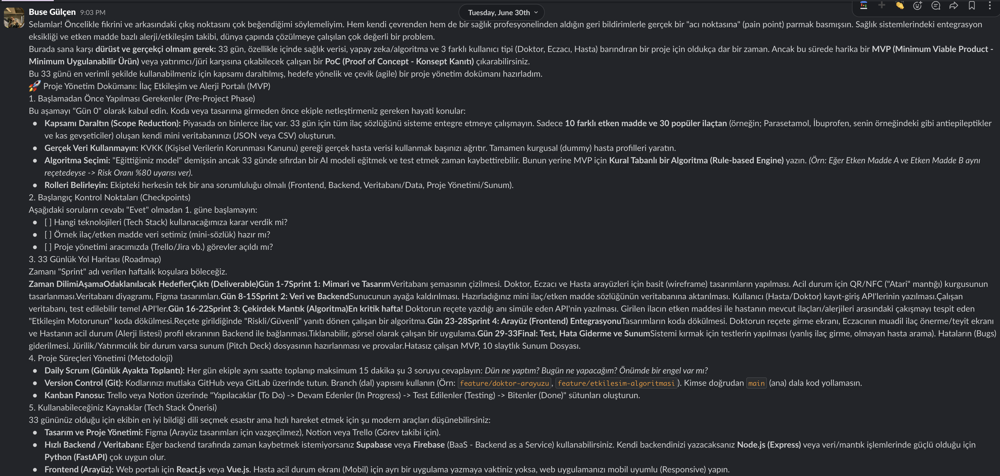
  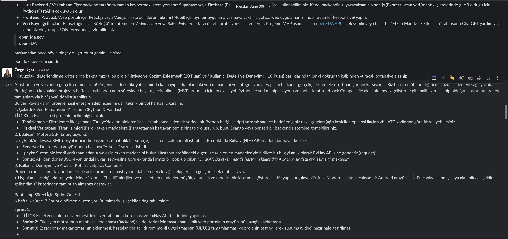
  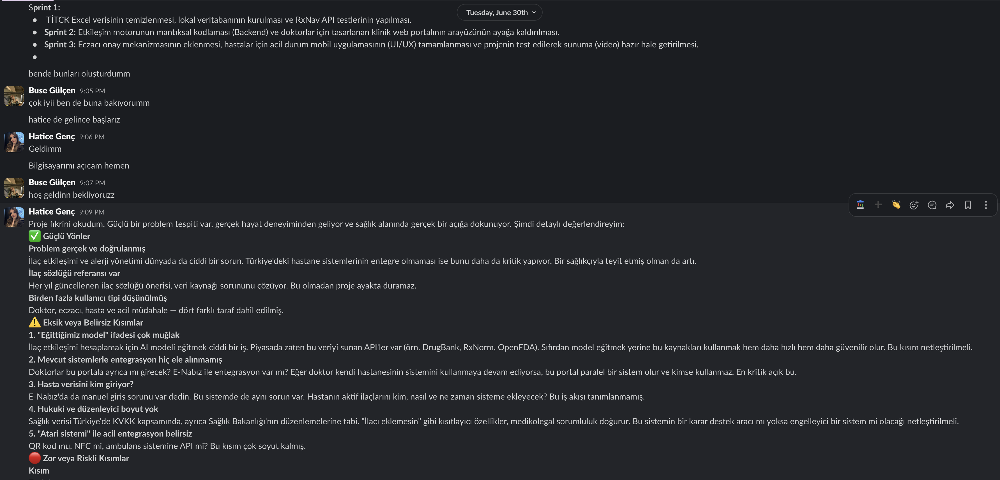
  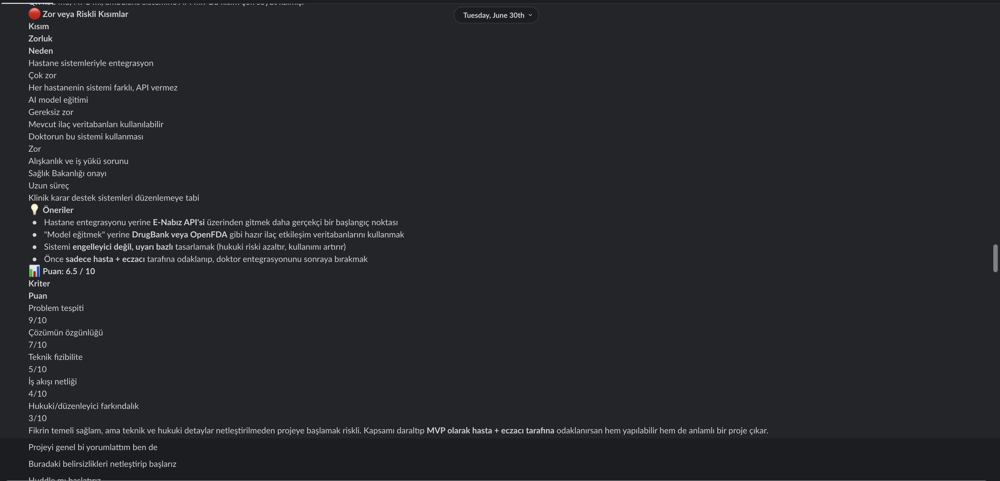

---

###  4. Veri Seti ve Kaynak Araştırmaları
Sistemimizi besleyecek olan TİTCK ve OpenFDA gibi medikal veri setlerinin tespiti ve entegrasyon araştırmaları:
* **Kaynak Taraması:**
  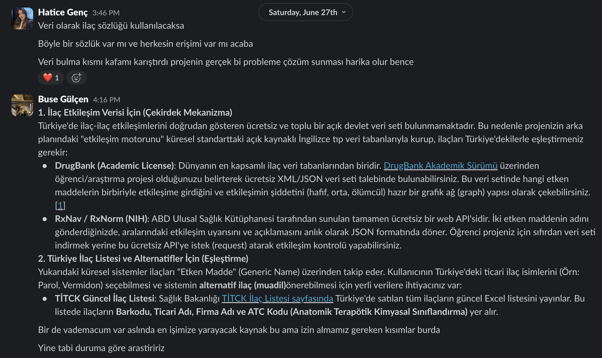
* **Veri Seti Detayları:**
  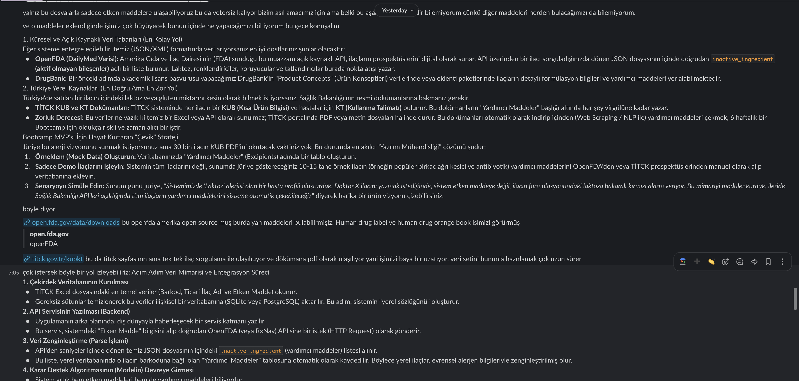
  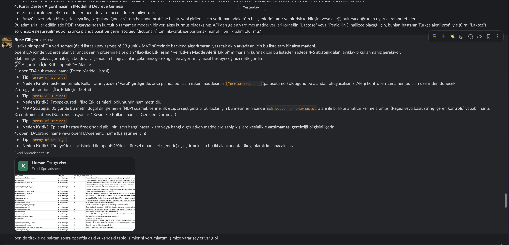
