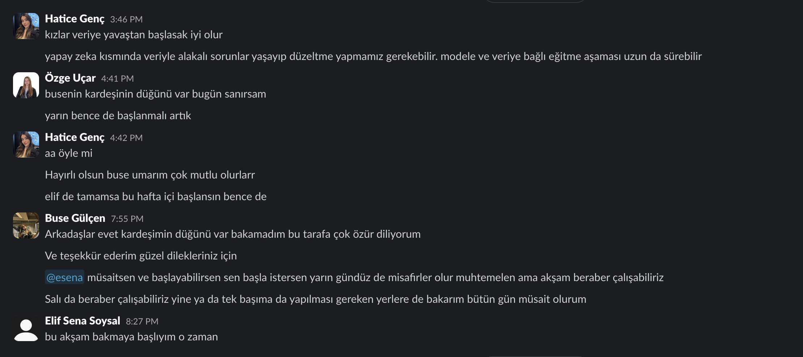
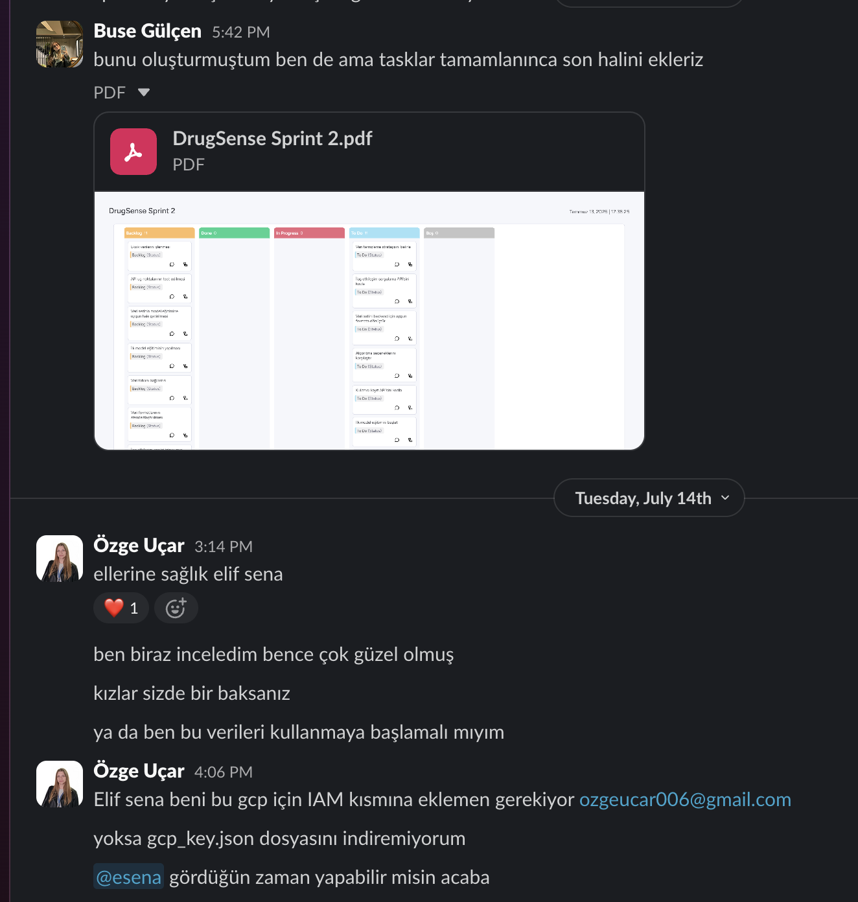
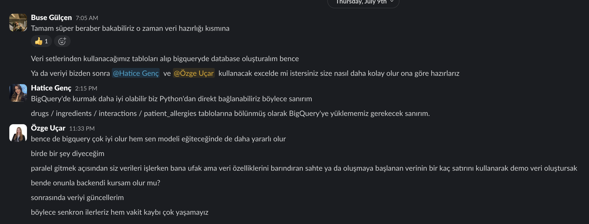
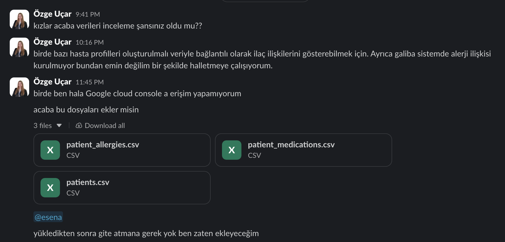

# Sprint 2 - İletişim, Toplantı ve Araştırma Kanıtları (Artifacts)

Bu dizin, **DrugSense** (Grup 37) takımının Sprint 2 boyunca yürüttüğü asenkron iletişim, fikir geliştirme, araştırma ve veri mimarisi süreçlerinin kanıtlarını içermektedir. Çevik (Agile) prensiplere uygun olarak takım içi senkronizasyon mesajlaşma platformları üzerinden kesintisiz sağlanmıştır.

---

### 1. Sprint Planlaması ve Takım İçi Koordinasyon
Takım üyelerinin uygunluk durumlarına göre veri görevlerinin zamanlanması ve oluşturulan güncel backlog board'unun paylaşılarak onaylanması:
* **Görev Planlaması ve Senkronizasyon:**
  
* **Backlog ve Durum Paylaşımı:**
  

---

### 2. Veri Mimarisi ve Teknoloji Kararları
Sistemi besleyecek verilerin nerede barındırılacağına dair platform (BigQuery) kararı ve takımların (AI ve Backend) eşzamanlı çalışabilmesi için "demo veri" stratejisinin belirlenmesi:
* **Veritabanı Platformu ve Geliştirme Stratejisi:**
  

---

### 3. Veritabanı Kurulumu ve Veri Hazırlığı
Google Cloud BigQuery şemalarının oluşturulması, DDInter ve TİTCK ham veri setlerinin temizlenip birleştirilmesi ile GitHub repozitorisine entegrasyon aşamaları:
* **Veri Temizliği, Birleştirme ve GitHub Entegrasyonu:**
  

---

### 4. Veri Entegrasyonu ve Erişim Süreçleri
Sisteme yüklenecek olan hasta, ilaç ve alerji (`patient_allergies.csv`, `patients.csv` vb.) profillerinin onaylanması ve Google Cloud (IAM) yetkilendirme süreçlerindeki engelleyici (blocker) durumların çözümü:
* **Veri Dosyalarının Paylaşımı ve GCP Erişim İzinleri:**
  
