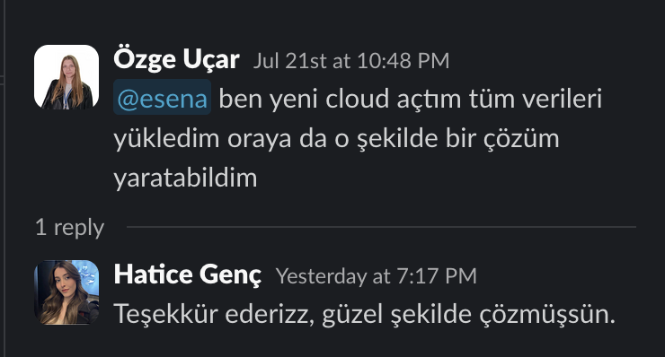
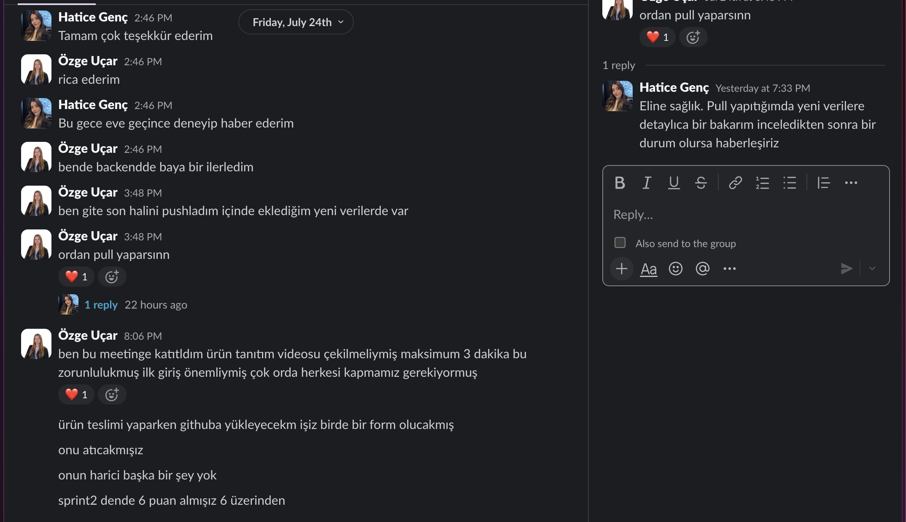
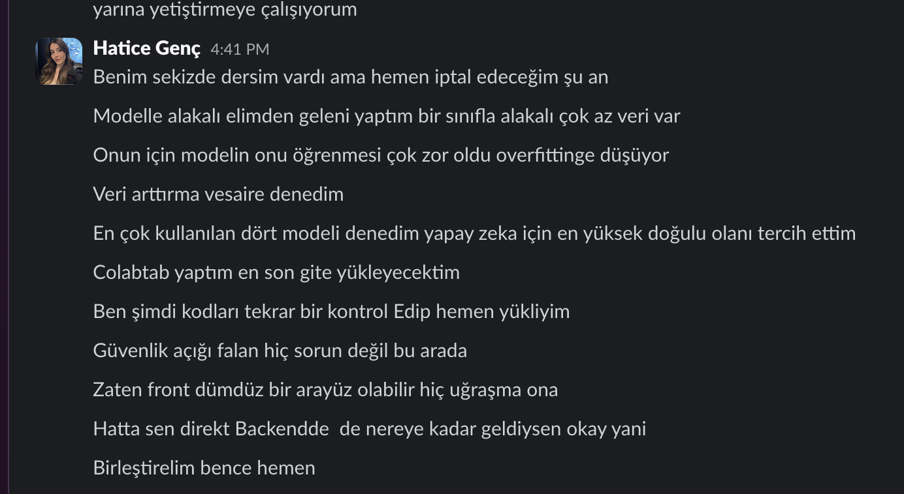
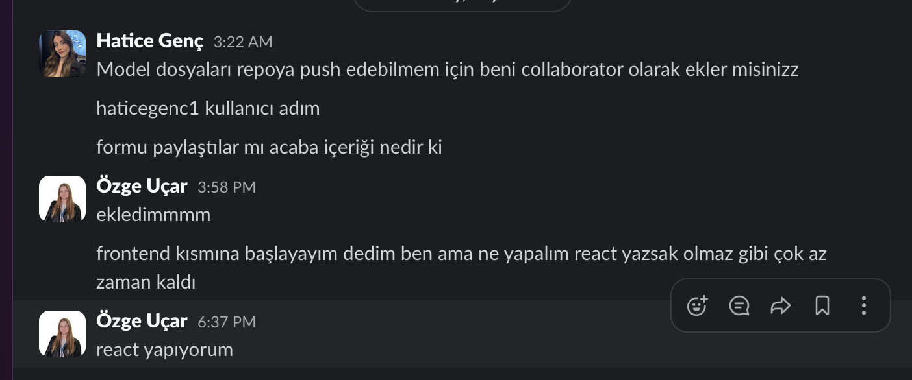
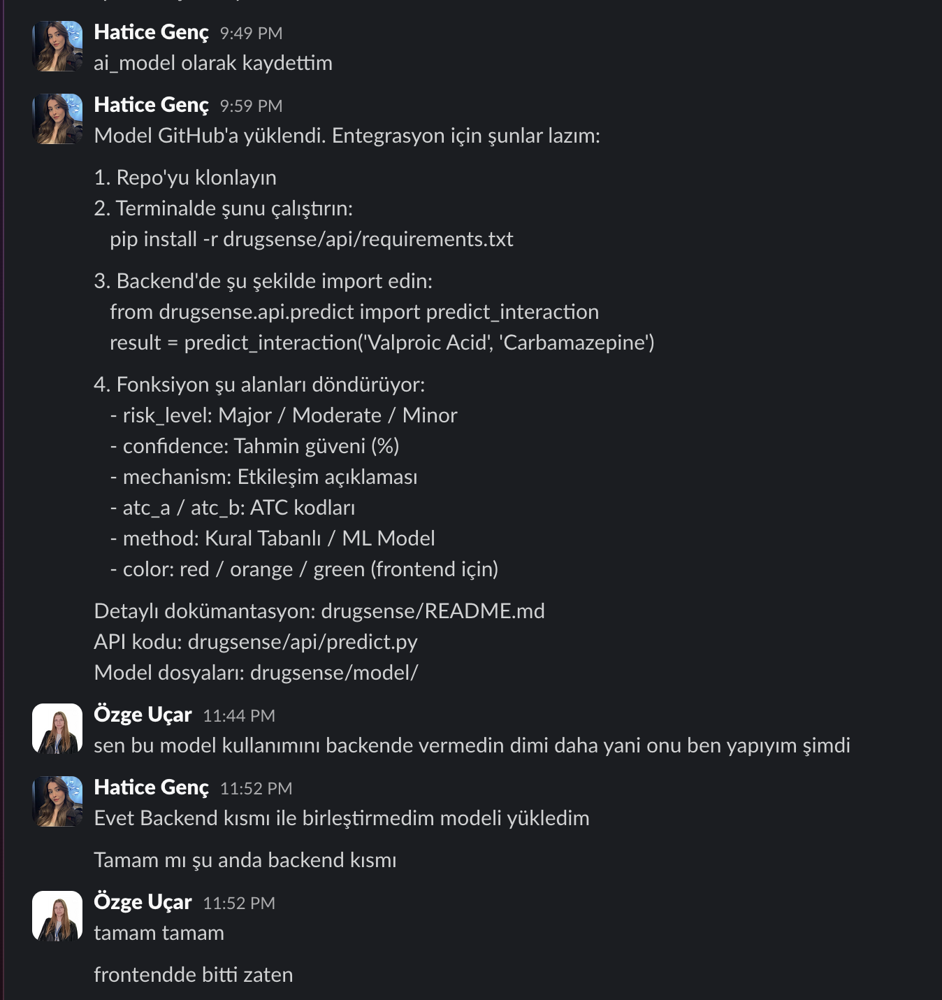
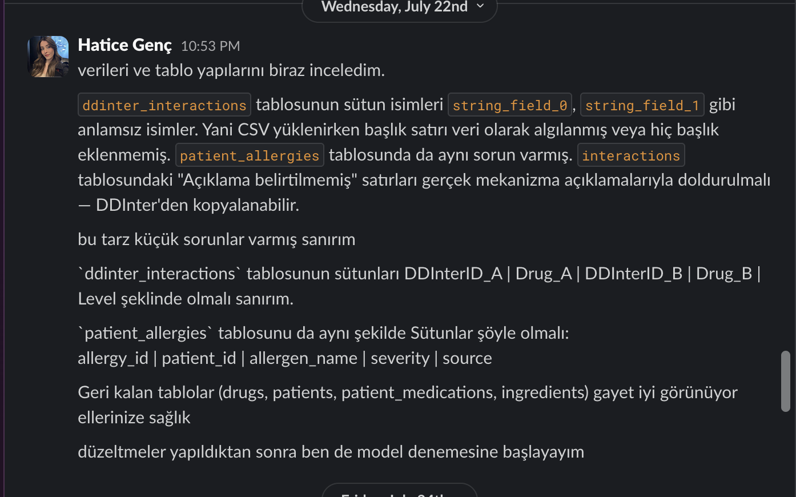
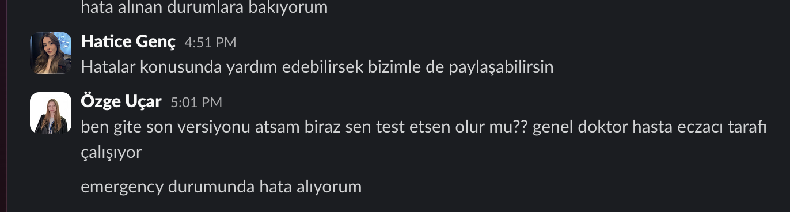

# Sprint 3 - İletişim, Model Eğitimi, Entegrasyon ve Kanıtlar (Artifacts)

Bu dizin, **DrugSense** (Grup 37) takımının Sprint 3 boyunca gerçekleştirdiği backend geliştirme çalışmaları, yapay zekâ modelinin eğitimi ve entegrasyonu, Google Cloud altyapısının kullanımı, frontend geliştirmeleri ve sistem entegrasyon süreçlerine ait görsel ve teknik kanıtları içermektedir.

Sprint 3 sürecinde sistem, bağımsız modüllerden tam entegre çalışan bir **Klinik Karar Destek Sistemi (CDSS)** haline getirilmiş; doktor, eczacı, hasta ve paramedik kullanıcı rollerinin tamamı tek platform üzerinde çalışacak şekilde geliştirilmiştir.

---

# 1. BigQuery Veritabanı ve Bulut Altyapısı

Google Cloud Platform üzerinde oluşturulan BigQuery veri ambarı sisteme entegre edilmiş ve tüm klinik veriler bulut ortamında yönetilmeye başlanmıştır.

Bu aşamada;

- BigQuery bağlantısı gerçekleştirildi.
- Klinik tablolar oluşturuldu.
- Hasta verileri sisteme aktarıldı.
- İlaç veritabanı yüklendi.
- DDInter etkileşim verileri entegre edildi.
- SQL sorguları test edildi.
- FastAPI ile BigQuery bağlantısı doğrulandı.

  

- BigQuery Dataset ekran görüntüleri
- Klinik tablolar
- SQL sorgu sonuçları
- Google Cloud bağlantı ekranları

---

# 2. Yapay Zekâ Modelinin Eğitimi

Sprint boyunca ilaç etkileşimlerini tahmin eden makine öğrenmesi modeli geliştirilmiştir.

Model geliştirme sürecinde;

- DDInter veri seti işlendi.
- Özellik mühendisliği gerçekleştirildi.
- Eğitim ve test verileri ayrıldı.
- XGBoost modeli eğitildi.
- Performans değerlendirmeleri yapıldı.
- Model dosyası oluşturuldu.

Model;

- İlaç etkileşim riski
- Risk seviyesi
- Klinik uyarılar

üretecek şekilde optimize edilmiştir.

  

- Model eğitim çıktıları
- Eğitim logları
- Accuracy sonuçları
- XGBoost eğitim ekranları

---

# 3. Yapay Zekâ Modelinin Backend'e Entegrasyonu

Eğitilen model FastAPI servislerine entegre edilmiştir.

Bu kapsamda;

- Model yükleme mekanizması geliştirildi.
- Prediction servisleri oluşturuldu.
- Cache mekanizması eklendi.
- Reçete analizi sırasında model otomatik çalışacak hale getirildi.

Kullanılan servisler:

- `predict_interaction()`
- `cached_predict()`

Sistem artık reçete oluşturulduğu anda ilaçlar arasında oluşabilecek etkileşimleri analiz etmektedir.

  

- Backend servis ekran görüntüleri
- Model entegrasyon kodları
- Prediction testleri
- API cevapları

---

# 4. Backend API Geliştirme

Sprint 3 kapsamında FastAPI tabanlı servis mimarisi büyük ölçüde tamamlanmıştır.

Geliştirilen başlıca modüller:

- Doktor Paneli API
- Eczacı Paneli API
- Hasta Paneli API
- Break Glass (Acil Erişim)
- Yan Etki Bildirim Sistemi
- Login Servisi
- İlaç Arama Servisi
- Reçete Analiz Servisi

Gerçekleştirilen geliştirmeler:

- BigQuery bağlantıları
- Parametreli SQL sorguları
- Audit Log sistemi
- Güvenlik kontrolleri
- Yetkilendirme işlemleri
- REST API endpointleri

- Swagger ekranları
- FastAPI endpoint testleri
- API Response çıktıları
- Backend logları

---

# 5. Frontend Arayüz Geliştirme

React ve Vite kullanılarak tüm kullanıcı panelleri geliştirilmiştir.

Tamamlanan ekranlar:

- Landing Page
- Login Sayfası
- Doktor Dashboard
- Eczacı Dashboard
- Hasta Paneli
- Break Glass Sayfası

Arayüz geliştirmelerinde;

- Responsive tasarım
- Material UI ikonları
- Tailwind CSS
- React Router
- Axios API bağlantıları

kullanılmıştır.

  

- Login ekranı
- Dashboard ekranları
- Acil erişim ekranı
- Hasta paneli
- Reçete analiz ekranı

---

# 6. Frontend ve Backend Entegrasyonu

Sprint 3 boyunca frontend ile backend servisleri tamamen entegre edilmiştir.

Gerçekleştirilen işlemler:

- Axios servisleri oluşturuldu.
- API istekleri bağlandı.
- JSON veri akışı sağlandı.
- Kullanıcı giriş sistemi tamamlandı.
- Rol bazlı yönlendirme geliştirildi.
- Reçete analiz sonuçları arayüze aktarıldı.

Sistem artık uçtan uca çalışmaktadır.

  

- API istekleri
- Network çıktıları
- Başarılı Response ekranları
- Canlı sistem görüntüleri

---

# 7. Break Glass (Acil Erişim) Modülü

Sprint 3 içerisinde geliştirilen en önemli modüllerden biri **Break Glass (Camı Kır)** mekanizmasıdır.

Bu modül sayesinde;

- Paramedikler
- Acil servis personeli

kritik durumlarda hastanın hayati sağlık bilgilerine güvenli şekilde erişebilmektedir.

Gösterilen bilgiler:

- Kronik hastalıklar
- Hasta alerjileri
- Operasyon geçmişi

Her erişim;

- Audit Log tablosuna kaydedilir.
- Güvenlik amacıyla kayıt altına alınır.

- Break Glass ekranı
- Swagger testleri
- Audit Log kayıtları
- BigQuery log çıktıları

---

# 8. Klinik Veri Doğrulama

Sistem üzerinde bulunan klinik veriler detaylı olarak test edilmiştir.

Kontrol edilen veriler:

- Hasta kayıtları
- Reçete geçmişi
- İlaç listeleri
- Kronik hastalıklar
- Alerjiler
- Etken maddeler
- DDInter kayıtları

Amaç;

üretilen analiz sonuçlarının gerçek veriler ile tutarlı olmasını sağlamaktır.

  

- BigQuery tabloları
- SQL sorguları
- Klinik veri ekranları
- Doğrulama çıktıları

---

# 9. Son Testler ve Sistem Kararlılığı

Sprint sonunda tüm modüller birlikte test edilmiştir.

Gerçekleştirilen testler:

- API testleri
- Frontend testleri
- BigQuery bağlantıları
- Model tahminleri
- Endpoint doğrulamaları
- Hata yönetimi
- Yetkilendirme kontrolleri
- Veri tipi uyumluluğu
- SQL sorgu doğrulamaları

Bu süreçte;

- `STRING / INT64`
- `DATE / TIMESTAMP`
- Yetki kontrolleri
- Parametre doğrulamaları
- Endpoint testleri

gibi hata senaryoları düzeltilmiş ve sistem kararlı hale getirilmiştir.

  

- Swagger testleri
- Postman çıktıları
- Terminal logları
- FastAPI log ekranları
- BigQuery sorgu sonuçları

---

# Sprint 3 Kazanımları

Sprint 3 sonunda;

- ✅ Google Cloud BigQuery altyapısı başarıyla entegre edildi.
- ✅ Yapay zekâ modeli eğitildi ve backend'e entegre edildi.
- ✅ FastAPI servisleri geliştirildi.
- ✅ React tabanlı kullanıcı arayüzleri tamamlandı.
- ✅ Frontend ve backend entegrasyonu sağlandı.
- ✅ Break Glass (Acil Erişim) modülü geliştirildi.
- ✅ Klinik karar destek mekanizması uçtan uca çalışır hale getirildi.
- ✅ Sistem gerçek hasta verileri ile test edildi.
- ✅ Tüm servisler birlikte çalışacak şekilde başarıyla entegre edildi.
